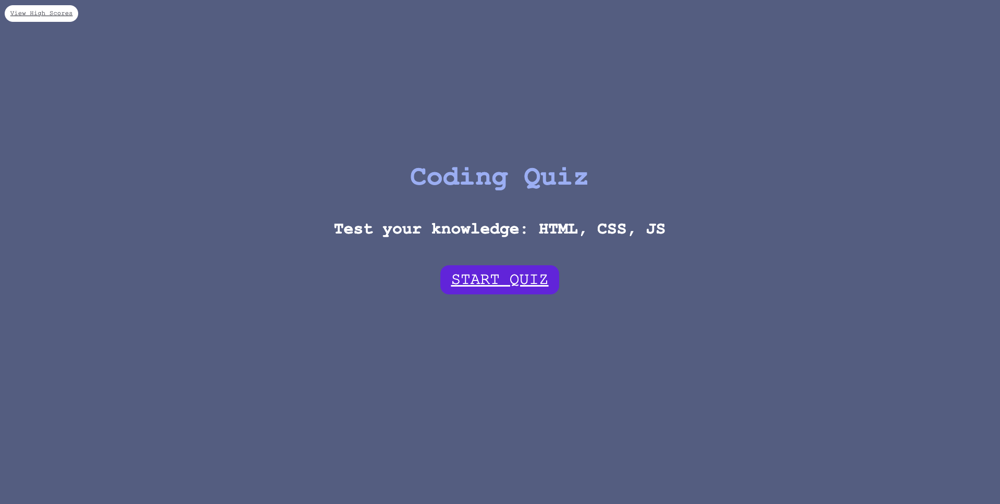
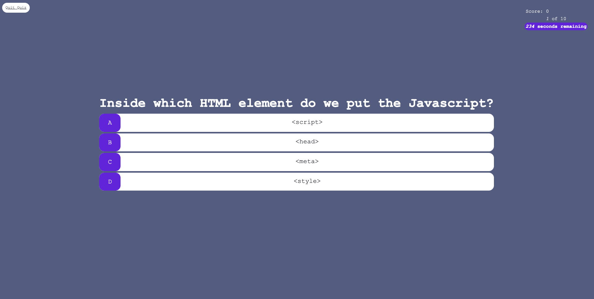
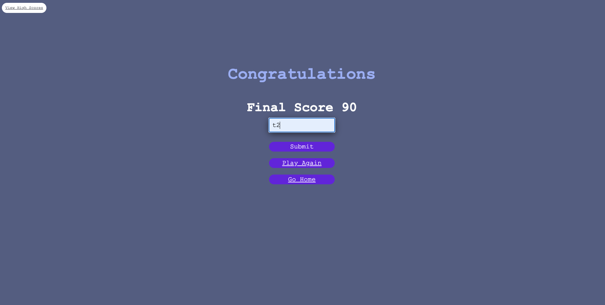
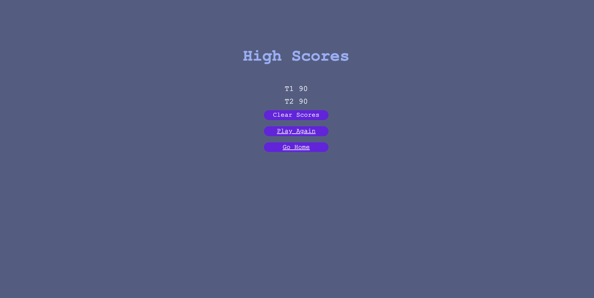

# timed-cs-quiz
Week 4 coding challenge to build an interactive quiz with a bank of coding / computer science questions
Completed Week 4 Homework Challenge to build Timed CS quiz by:
1. Ensuring codebase has good accessibility
2. Maximizing stylesheet across pages
3. Minimizing weight of javascript across pages

##### Table of Contents
[User Story] (#userstory)
[Acceptance Criteria] (#acceptancecriteria)
[Mock Up] (#mockup)
[Deployed Application] (#deployedapplication)

## User Story

## Acceptance Criteria

## Mock-up

The following images show the web application's appearance and functionality:

## Deployed Application Link
